# Project Visionary — Production RAG Implementation Plan
**GCP · Go 1.22 · AlloyDB ScaNN · Vertex AI · Python 3.11 · Redis 7.x**
**CBSE Science · Grades 6–8 · 1,000+ Concurrent Students**
*Version 1.0 — March 2026 | Based on Architecture v2.0 (audit-corrected)*

---

## Table of Contents

1. [System Architecture](#1-system-architecture)
2. [Repository Structure](#2-repository-structure)
3. [Phase 1 — Infrastructure (Days 1–3)](#3-phase-1--infrastructure-days-13)
4. [Phase 2 — Python Ingestion (Days 4–6)](#4-phase-2--python-ingestion-days-46)
5. [Phase 3 — Go Orchestration (Days 7–10)](#5-phase-3--go-orchestration-days-710)
6. [Phase 4 — Hybrid Search & RRF (Days 11–12)](#6-phase-4--hybrid-search--rrf-days-1112)
7. [Phase 5 — Quality Loop (Days 13–14)](#7-phase-5--quality-loop-days-1314)
8. [Testing Strategy](#8-testing-strategy)
9. [Observability Wiring](#9-observability-wiring)
10. [Deployment & CI/CD](#10-deployment--cicd)
11. [Sprint Verification Checklist](#11-sprint-verification-checklist)

---

## 1. System Architecture

### 1.1 Full System Data Flow

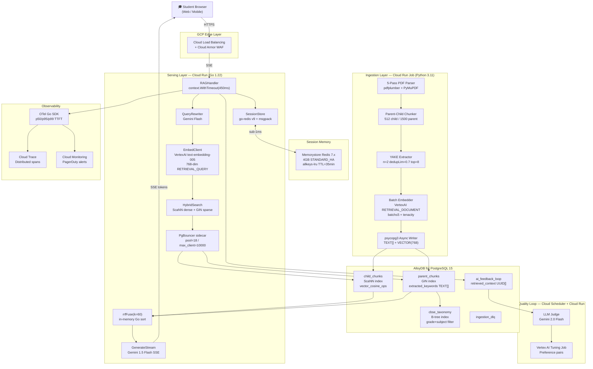

### 1.2 Request Lifecycle (Sequence)

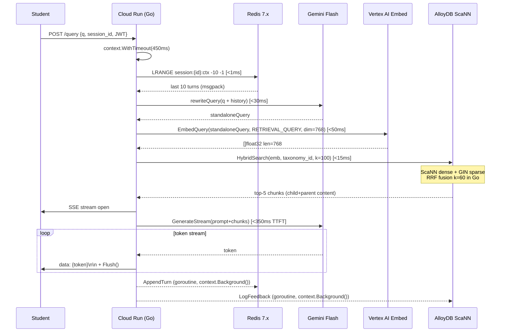

### 1.3 TTFT Latency Budget

```mermaid
gantt
    title TTFT Latency Budget — 500ms Total
    dateFormat  X
    axisFormat  %sms

    section Budget Allocation
    Redis session read        :done, 0, 1
    Query rewriting (Gemini)  :done, 1, 31
    Vertex AI embedding       :done, 31, 81
    AlloyDB HybridSearch      :done, 81, 96
    RRF fusion (in-memory)    :done, 96, 97
    Gemini 1.5 Flash TTFT     :crit, 97, 447
    SSE framing headroom      :active, 447, 497
```

---

## 2. Repository Structure

```
visionary/
├── terraform/                    # Phase 1
│   ├── main.tf
│   ├── variables.tf
│   └── outputs.tf
├── schema/                       # Phase 1
│   └── v2_production.sql
├── ingestion/                    # Phase 2
│   ├── Dockerfile
│   ├── pyproject.toml
│   ├── parser/
│   │   ├── __init__.py
│   │   ├── font_calibrator.py    # Pass 1
│   │   ├── table_extractor.py    # Pass 2
│   │   ├── heading_mapper.py     # Pass 3
│   │   ├── formula_detector.py   # Pass 4
│   │   └── metadata_enricher.py  # Pass 5
│   ├── chunker/
│   │   ├── __init__.py
│   │   └── parent_child.py
│   ├── keywords/
│   │   └── yake_extractor.py
│   ├── embedder/
│   │   └── vertex_batch.py
│   ├── writer/
│   │   └── alloydb_writer.py
│   ├── pipeline.py               # orchestrates all passes
│   └── tests/
│       ├── test_parser.py
│       ├── test_chunker.py
│       └── test_writer.py
├── orchestrator/                 # Phase 3 + 4
│   ├── Dockerfile
│   ├── go.mod
│   ├── go.sum
│   ├── cmd/
│   │   └── server/
│   │       └── main.go
│   ├── handler/
│   │   ├── rag_handler.go        # Phase 3
│   │   └── rag_handler_test.go
│   ├── retrieval/
│   │   ├── hybrid_search.go      # Phase 4
│   │   ├── rrf.go                # Phase 4
│   │   └── retrieval_test.go
│   ├── session/
│   │   ├── redis_store.go        # Phase 3
│   │   └── session_test.go
│   ├── embed/
│   │   ├── vertex_client.go      # Phase 3
│   │   └── embed_test.go
│   ├── db/
│   │   ├── alloydb.go            # Phase 3
│   │   └── pgvector_types.go
│   ├── observability/
│   │   └── otel.go               # Phase 3 + 9
│   └── config/
│       └── config.go
├── quality_loop/                 # Phase 5
│   ├── Dockerfile
│   ├── pyproject.toml
│   ├── judge.py
│   ├── feedback_processor.py
│   └── tests/
│       └── test_judge.py
├── eval/                         # Phase 4 + 8
│   ├── recall_eval.py
│   └── sample_qna/
│       ├── grade6_biology.jsonl
│       ├── grade7_chemistry.jsonl
│       └── grade8_physics.jsonl
└── .github/
    └── workflows/
        ├── ci.yml
        └── deploy.yml
```

---

## 3. Phase 1 — Infrastructure (Days 1–3)

### Task Graph

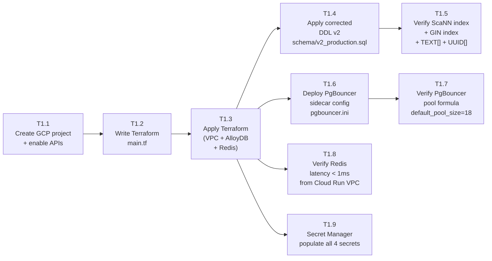

### Atomic Tasks

---

#### T1.1 — Create GCP Project + Enable APIs
**File:** `terraform/main.tf` (provider block only)
**Time:** 30 min

Enable APIs:
```
alloydb.googleapis.com
redis.googleapis.com
run.googleapis.com
aiplatform.googleapis.com
secretmanager.googleapis.com
cloudtrace.googleapis.com
monitoring.googleapis.com
artifactregistry.googleapis.com
cloudbuild.googleapis.com
```

**Verify:** `gcloud services list --enabled | grep alloydb`

---

#### T1.2 — Write Terraform `main.tf`
**File:** `terraform/main.tf`
**Time:** 2 hours

Resources in order:
1. `google_compute_network.vpc` — custom VPC, no auto-subnets
2. `google_compute_subnetwork.cloud_run` — asia-south1, `10.8.0.0/24`
3. `google_vpc_access_connector.connector` — Cloud Run → VPC bridge
4. `google_alloydb_cluster.visionary` — REGIONAL, automated backup 04:00 UTC
5. `google_alloydb_instance.primary` — 8 vCPU, REGIONAL availability
6. `google_redis_instance.session` — 4GB, STANDARD_HA, REDIS_7_0
7. `google_cloud_run_v2_service.orchestrator` — min=2, max=100, cpu_idle=false
8. `google_secret_manager_secret` × 4 (alloydb-dsn, redis-addr, vertex-sa, jwt-secret)
9. `google_artifact_registry_repository.images`

**Critical Terraform settings:**
```hcl
# AlloyDB — REGIONAL for 99.99% SLA
availability_type = "REGIONAL"

# Cloud Run — never scale to zero (TTFT SLA)
min_instance_count = 2
cpu_idle           = false

# Redis — 60% of RAM cap prevents OOM kill
redis_configs = {
  "maxmemory-policy" = "allkeys-lru"
  "maxmemory"        = "2621440kb"
}
```

**Verify:** `terraform plan` shows 0 errors, 9 resources to create

---

#### T1.3 — Apply Terraform
**Time:** 45 min (AlloyDB cluster creation takes ~20 min)

```bash
terraform init
terraform apply -target=google_compute_network.vpc
terraform apply -target=google_alloydb_cluster.visionary
terraform apply  # remaining resources
```

**Verify:**
```bash
gcloud alloydb clusters list --region=asia-south1
gcloud redis instances list --region=asia-south1
```

---

#### T1.4 — Apply Corrected DDL `v2_production.sql`
**File:** `schema/v2_production.sql`
**Time:** 30 min

Apply in this exact order (FK dependencies):
1. Extensions: `vector`, `btree_gin`, `pgcrypto`
2. `cbse_taxonomy` table + populate with Grade 6–8 Science chapters
3. `parent_chunks` table — **`extracted_keywords TEXT[]`** (not TEXT)
4. `child_chunks` table — `embedding VECTOR(768)`
5. `ingestion_dlq` table
6. `ai_feedback_loop` table — **`retrieved_context UUID[]`** (not UUID)
7. All indexes (ScaNN, GIN, B-tree, partial)

```bash
psql $ALLOYDB_DSN -f schema/v2_production.sql 2>&1 | grep -E "ERROR|WARNING|CREATE"
```

**Critical:** ScaNN `CREATE INDEX` requires AlloyDB — will fail on Cloud SQL. Verify you're connected to AlloyDB endpoint.

---

#### T1.5 — Verify Schema Correctness
**Time:** 15 min

```sql
-- Verify TEXT[] (not TEXT)
SELECT column_name, data_type, udt_name
FROM information_schema.columns
WHERE table_name = 'parent_chunks' AND column_name = 'extracted_keywords';
-- Expected: data_type = 'ARRAY', udt_name = '_text'

-- Verify UUID[] (not UUID)
SELECT column_name, data_type, udt_name
FROM information_schema.columns
WHERE table_name = 'ai_feedback_loop' AND column_name = 'retrieved_context';
-- Expected: data_type = 'ARRAY', udt_name = '_uuid'

-- Verify ScaNN index exists
SELECT indexname, indexdef FROM pg_indexes
WHERE tablename = 'child_chunks' AND indexname = 'idx_child_embedding_scann';

-- Verify GIN index uses array_ops
SELECT indexname, indexdef FROM pg_indexes
WHERE tablename = 'parent_chunks' AND indexname = 'idx_parent_keywords_gin';
-- Expected: USING gin (extracted_keywords)

-- Verify partial indexes
SELECT indexname FROM pg_indexes WHERE indexdef LIKE '%WHERE%';
-- Expected: idx_dlq_failed, idx_feedback_unprocessed
```

**Exit criteria:** All 5 SQL checks return expected results. Zero ERROR lines in DDL apply output.

---

#### T1.6 — Deploy PgBouncer Sidecar
**File:** `orchestrator/pgbouncer/pgbouncer.ini`
**Time:** 30 min

```ini
[databases]
visionary = host=ALLOYDB_PRIVATE_IP port=5432 dbname=visionary

[pgbouncer]
pool_mode              = transaction
max_client_conn        = 10000
default_pool_size      = 18          # ≤ 0.9 × max_connections(20)
reserve_pool_size      = 3           # 15% of 18
reserve_pool_timeout   = 5.0
max_prepared_statements = 1000
query_wait_timeout     = 120
client_idle_timeout    = 600
server_idle_timeout    = 540         # must be < client_idle_timeout
auth_type              = scram-sha-256
auth_file              = /etc/pgbouncer/userlist.txt
log_connections        = 1
log_disconnections     = 1
stats_period           = 60
```

---

#### T1.7 — Verify PgBouncer Pool
**Time:** 15 min

```bash
psql -h localhost -p 6432 -U pgbouncer pgbouncer -c "SHOW POOLS;"
# Verify: default_pool_size = 18, not 10000
psql -h localhost -p 6432 -U pgbouncer pgbouncer -c "SHOW CONFIG;"
# Verify: max_client_conn = 10000
```

---

#### T1.8 — Verify Redis Latency
**Time:** 15 min

```bash
# From within Cloud Run VPC connector range
redis-cli -h $REDIS_IP ping
redis-cli -h $REDIS_IP --latency-history -i 1
# Verify: p50 < 1ms
```

---

#### T1.9 — Populate Secret Manager
**Time:** 20 min

```bash
echo -n "host=ALLOYDB_IP dbname=visionary user=visionary password=X" \
  | gcloud secrets create alloydb-dsn --data-file=-

echo -n "REDIS_IP:6379" \
  | gcloud secrets create redis-addr --data-file=-

gcloud secrets create vertex-sa --data-file=service_account.json
gcloud secrets create jwt-secret --data-file=jwt.key
```

**Never:** commit secrets to `terraform.tfvars` or `.env` files.

---

### Phase 1 Exit Criteria

```
✅ AlloyDB REGIONAL cluster running, ScaNN extension enabled
✅ extracted_keywords is TEXT[] (verified via pg_indexes + column query)
✅ retrieved_context is UUID[] (verified via column query)
✅ ScaNN index on child_chunks.embedding created successfully
✅ GIN index on parent_chunks.extracted_keywords created successfully
✅ PgBouncer default_pool_size = 18, max_client_conn = 10000
✅ Redis p50 < 1ms from VPC connector range
✅ All 4 secrets in Secret Manager
```

---

## 4. Phase 2 — Python Ingestion (Days 4–6)

### Task Graph

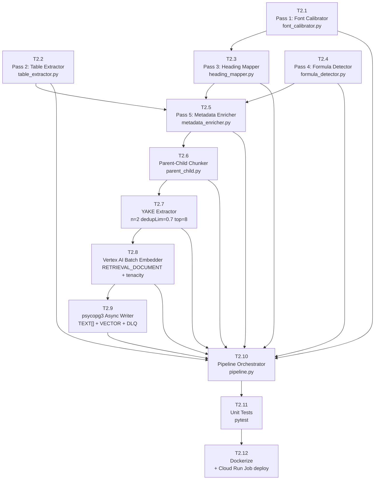

### Atomic Tasks

---

#### T2.1 — Pass 1: Font Calibrator
**File:** `ingestion/parser/font_calibrator.py`
**Time:** 1 hour

```python
# Inputs:  fitz.Document
# Outputs: Dict[str, float] — {body, section, chapter}
# Logic:
#   - Sample first 20 pages via page.get_text("dict")
#   - Collect all span sizes where len(text.strip()) > 3
#   - body    = statistics.mode(sizes)
#   - section = sorted(sizes)[int(n * 0.90)]
#   - chapter = sorted(sizes)[int(n * 0.97)]
#   - Safety clamps: section = max(section, body+1), chapter = max(chapter, section+1)
```

**Unit test:** 3 PDFs from different publishers → assert no threshold is equal to another

---

#### T2.2 — Pass 2: Table Extractor
**File:** `ingestion/parser/table_extractor.py`
**Time:** 45 min

```python
# Inputs:  pdfplumber.Page
# Outputs: List[TableElement(markdown: str, bbox: Tuple[float,float,float,float])]
# Logic:
#   - page.find_tables() → iterate
#   - tbl.extract() → _table_to_markdown(rows)
#   - Store bbox for Pass 5 exclusion zones
#   - Atomic: never split a table across pages
```

**Unit test:** Page with 2 tables → assert 2 TableElements returned, both have non-empty markdown

---

#### T2.3 — Pass 3: Heading Mapper
**File:** `ingestion/parser/heading_mapper.py`
**Time:** 1.5 hours

```python
# Inputs:  fitz.Document, thresholds (from Pass 1), toc_map (from PyMuPDF ToC)
# Outputs: Dict[int, HeadingContext(chapter, section, subsection)]
# Detection signals (any one sufficient):
#   1. font_size >= chapter_threshold   → chapter
#   2. font_size >= section_threshold   → section
#   3. bold flag (flags & 2**4) AND size > body+0.5 → section
#   4. numbered_section_regex match AND size >= body-0.5 → subsection
# numbered_section_regex = r"^(?:Chapter\s+\d+|\d+\.\d+(?:\.\d+)?|[A-Z][A-Z ]{4,})\b"
# Skip noise: r"^(\d{1,3}|page\s*\d+|\d+\s*/\s*\d+|www\.|http)$"
```

**Unit test:** NCERT-style PDF → assert chapter names from ToC match heading_map values

---

#### T2.4 — Pass 4: Formula Detector
**File:** `ingestion/parser/formula_detector.py`
**Time:** 1 hour

```python
# Inputs:  str (prose text)
# Outputs: content_type: "prose" | "formula", formula_annotations: List[str]
# Patterns:
#   chemical_formula = r"\b[A-Z][a-z]?\d*(?:[A-Z][a-z]?\d*)+\b"
#   subscript_flag   = check span flags for superscript/subscript (PyMuPDF flags & 1 or 2)
#   measurement      = r"\d+(?:\.\d+)?\s*(?:km|m|cm|mm|kg|g|mg|°C|K|J|W|Hz|nm|μm|mol|L|ml)"
# content_type = "formula" if chemical_formula matches OR subscript_flag present
```

**Unit test:** "CO₂ + H₂O" → content_type="formula"; "The cell membrane" → content_type="prose"

---

#### T2.5 — Pass 5: Metadata Enricher
**File:** `ingestion/parser/metadata_enricher.py`
**Time:** 45 min

```python
# Inputs:  raw prose text, HeadingContext, page_number, content_type, taxonomy_id
# Outputs: ParsedElement(
#     text, page_number, chapter, section, subsection,
#     grade, subject, content_type, taxonomy_id
# )
# Logic: Combine outputs of passes 1-4 into a single structured element.
#        Apply heading_map[page] to each text block.
#        Cross-chapter contamination check: assert taxonomy_id not None
```

---

#### T2.6 — Parent-Child Chunker
**File:** `ingestion/chunker/parent_child.py`
**Time:** 1.5 hours

```python
# Inputs:  List[ParsedElement]
# Outputs: (List[ChildChunk], Dict[UUID, str])
#
# Tables → atomic (parent_id == child_id, no splitting)
# Prose  → parent splitter: max_chars=1500, overlap=100
#           child splitter:  max_chars=512,  overlap=77 (15%)
#
# class RecursiveCharacterTextSplitter:
#   separators = ["\n\n", "\n", ". ", " ", ""]
#   _split → _merge with sliding overlap window
#
# ChildChunk fields:
#   child_id: UUID (gen_random_uuid equivalent — uuid4())
#   parent_id: UUID
#   content: str (≤512 chars, enforced by assertion)
#   taxonomy_id: int
#   page_number: int
#   content_type: str
```

**Unit test:** 3000-char passage → assert all child.content len ≤ 512

---

#### T2.7 — YAKE Extractor
**File:** `ingestion/keywords/yake_extractor.py`
**Time:** 30 min

```python
# Config — CBSE-optimised (NOT defaults):
extractor = yake.KeywordExtractor(
    lan="en",
    n=2,           # bigrams only — NOT 3
    dedupLim=0.7,  # NOT 0.9 — removes H2O/water/hydrogen oxide variants
    top=8,         # NOT 20 — ~375-token parents have 12-15 concepts max
    features=None  # keep default 5-feature set, do NOT disable TRel
)

# Inputs:  parent_chunk.content (str)
# Outputs: List[str] — keyword list for TEXT[] column
# Note: YAKE score is LOWER = MORE RELEVANT. Top-8 are lowest-score keywords.
# Validate: assert all(len(kw.split()) <= 2 for kw in keywords)
```

**Unit test:** "The cell membrane controls what enters and exits the cell" → assert "cell membrane" in keywords

---

#### T2.8 — Vertex AI Batch Embedder
**File:** `ingestion/embedder/vertex_batch.py`
**Time:** 1.5 hours

```python
# Model: text-embedding-005 (NOT gecko@003 — deprecated)
# Task type: RETRIEVAL_DOCUMENT (ingestion) — NOT RETRIEVAL_QUERY
# output_dimensionality: 768 (explicit — do NOT rely on default)
# Batch size: ≤5 texts per API call (Vertex AI limit)
# Retry: tenacity.retry(
#     wait=wait_exponential(multiplier=1, min=2, max=60),
#     stop=stop_after_attempt(5),
#     retry=retry_if_exception_type(ResourceExhausted)
# )

# Inputs:  List[str] (child chunk contents)
# Outputs: List[List[float]] — each inner list len=768
# Validate: assert all(len(emb) == 768 for emb in embeddings)
```

**Unit test:** Batch of 12 texts → assert 3 API calls made (ceil(12/5)=3), output shape (12, 768)

---

#### T2.9 — psycopg3 Async Writer
**File:** `ingestion/writer/alloydb_writer.py`
**Time:** 2 hours

```python
# Critical: use psycopg3 (psycopg), NOT psycopg2
# Reason: psycopg2 lacks native async; psycopg3 supports asyncio natively
# TEXT[] marshalling: pass Python list → psycopg3 maps to TEXT[]
# VECTOR: use pgvector's register_vector(conn) for VECTOR type

# Transaction pattern (atomic parent+child insert with DLQ routing):
async def insert_parent_child(conn, parent: ParentChunk, children: List[ChildChunk]):
    async with conn.transaction():
        try:
            parent_id = await _insert_parent(conn, parent)
            for child in children:
                await _insert_child(conn, child, parent_id)
        except Exception as e:
            await _insert_dlq(conn, payload=parent.dict(), error=str(e))
            raise  # re-raise to trigger transaction rollback

# DLQ: if child insert fails, parent insert is rolled back.
# Both or neither — never partial state.
```

**Unit test (integration):** Simulate child insert failure → assert parent rolled back + DLQ row inserted

---

#### T2.10 — Pipeline Orchestrator
**File:** `ingestion/pipeline.py`
**Time:** 1 hour

```python
# End-to-end orchestration:
# 1. open PDF with fitz + pdfplumber
# 2. Pass 1: calibrate_font_thresholds(pdf_fitz)
# 3. Pass 2+3+4+5 per page: extract_tables, map_headings, detect_formulas, enrich_metadata
# 4. create_parent_child_chunks(elements)
# 5. extract_keywords(parent.content) for each parent
# 6. embed_batch(child.content for all children)
# 7. async insert_parent_child() for each (parent, children) pair
# 8. DLQ: log failures, continue pipeline (don't abort on single-chunk failure)
#
# CLI: python pipeline.py --pdf path/to/textbook.pdf --grade 7 --subject "Science"
#       --taxonomy_id 42
```

---

#### T2.11 — Unit Tests
**File:** `ingestion/tests/`
**Time:** 2 hours

```
test_parser.py:
  test_calibrate_cross_publisher_fonts()    → 3 PDFs, different publishers
  test_table_extraction_with_bbox()         → table bbox excludes from prose
  test_heading_detection_numbered_section() → "3.2 Cell Structure" → section
  test_formula_detection_CO2()              → content_type = "formula"

test_chunker.py:
  test_child_max_512_chars()                → all children ≤ 512
  test_parent_max_1500_chars()              → all parents ≤ 1500
  test_table_atomic_no_split()              → table chunk_id == parent_id
  test_overlap_15_percent()                 → overlap ≈ 77 chars

test_writer.py:
  test_text_array_insertion()               → SELECT array_length() = expected
  test_transaction_rollback_on_failure()    → DLQ row created, parent not in DB
  test_uuid_array_feedback_insert()         → retrieved_context stores 5 UUIDs
```

**Run:** `pytest ingestion/tests/ -v --cov=ingestion --cov-report=term-missing`
**Target:** ≥80% statement coverage

---

#### T2.12 — Dockerize + Deploy Cloud Run Job
**File:** `ingestion/Dockerfile`
**Time:** 45 min

```dockerfile
FROM python:3.11-slim
WORKDIR /app
# Install C libs for pymupdf, pdfplumber
RUN apt-get update && apt-get install -y libmupdf-dev gcc && rm -rf /var/lib/apt/lists/*
COPY pyproject.toml .
RUN pip install --no-cache-dir .
COPY . .
CMD ["python", "pipeline.py"]
```

Deploy as Cloud Run Job (not Service — batch mode, billed only during execution).

---

### Phase 2 Exit Criteria

```
✅ Ingest CBSE Grade 7 Science sample PDF successfully
✅ SELECT array_length(extracted_keywords, 1) FROM parent_chunks LIMIT 5
   → returns values between 6 and 8 for all rows
✅ All child.content lengths ≤ 512 chars
✅ DLQ routing: simulated embedding API failure → ingestion_dlq row inserted
✅ Transaction rollback: simulated child insert failure → parent NOT in DB
✅ Pytest: ≥80% coverage, 0 failures
```

---

## 5. Phase 3 — Go Orchestration (Days 7–10)

### Task Graph

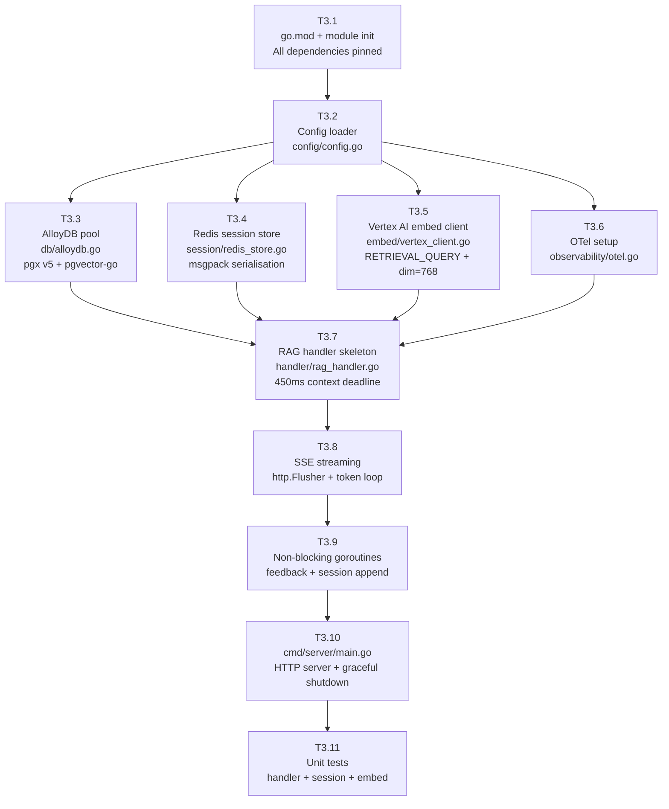

### Atomic Tasks

---

#### T3.1 — `go.mod` + Module Init
**File:** `orchestrator/go.mod`
**Time:** 30 min

```go
module github.com/visionary/orchestrator

go 1.22

require (
    github.com/tmc/langchaingo          v0.1.12
    github.com/pgvector/pgvector-go     v0.2.0
    github.com/jackc/pgx/v5             v5.5.0
    github.com/redis/go-redis/v9        v9.5.0
    google.golang.org/genai             v0.5.0
    github.com/vmihailescu/msgpack      v5.4.1
    go.opentelemetry.io/otel            v1.24.0
    go.opentelemetry.io/otel/trace      v1.24.0
    go.opentelemetry.io/otel/sdk        v1.24.0
    go.opentelemetry.io/otel/exporters/otlp/otlptrace/otlptracegrpc v1.24.0
    github.com/stretchr/testify         v1.9.0
)
```

---

#### T3.2 — Config Loader
**File:** `orchestrator/config/config.go`
**Time:** 30 min

```go
// Config fields:
//   AlloyDBDSN        string  // from Secret Manager env injection
//   RedisAddr         string  // from Secret Manager env injection
//   VertexProject     string
//   VertexLocation    string  // "asia-south1"
//   EmbedModel        string  // "text-embedding-005"
//   EmbedDimension    int     // 768
//   LLMModel          string  // "gemini-1.5-flash"
//   TopK              int     // 5
//   RRFk              float64 // 60.0
//   ContextTimeout    time.Duration // 450ms
//   PgMaxConns        int     // 18 (match PgBouncer pool)
//   RedisMaxRetries   int     // 3
```

---

#### T3.3 — AlloyDB Pool
**File:** `orchestrator/db/alloydb.go`
**Time:** 1.5 hours

```go
// Use pgx v5 pool (NOT database/sql — pgx native pool is faster)
// Critical: AfterConnect hook to RegisterTypes for VECTOR
//
// config.AfterConnect = func(ctx context.Context, conn *pgx.Conn) error {
//     return pgvector.RegisterTypes(ctx, conn)
// }
//
// Pool config:
//   MaxConns:          18  // match PgBouncer default_pool_size
//   MinConns:          2   // keep warm connections
//   MaxConnLifetime:   30 * time.Minute
//   MaxConnIdleTime:   5 * time.Minute
//   HealthCheckPeriod: 1 * time.Minute
//
// Connection string: must go through PgBouncer sidecar (localhost:6432)
// NOT direct to AlloyDB — defeats pooling
```

---

#### T3.4 — Redis Session Store
**File:** `orchestrator/session/redis_store.go`
**Time:** 1.5 hours

```go
// Key schema: session:{session_id}:ctx
// Serialisation: msgpack (50-70% smaller than JSON)
//
// GetHistory(ctx, sessionID, lastN) → []Turn
//   LRANGE session:{id}:ctx -lastN -1 → deserialise msgpack
//   On error → return empty []Turn (never fatal)
//
// AppendTurn(ctx, sessionID, role, content) → error
//   RPUSH session:{id}:ctx msgpack(Turn{role, content, ts})
//   EXPIRE session:{id}:ctx 2100  // 35 min = 30min idle + 5min race buffer
//   Use pipeline for RPush+Expire atomicity
//
// Turn struct: { Role string; Content string; Timestamp int64 }
```

---

#### T3.5 — Vertex AI Embed Client
**File:** `orchestrator/embed/vertex_client.go`
**Time:** 1.5 hours

```go
// SDK: google.golang.org/genai (NOT deprecated vertexai package)
// Model: "text-embedding-005"
// Task type for serving: "RETRIEVAL_QUERY" (not RETRIEVAL_DOCUMENT)
// output_dimensionality: 768 (explicit — do not rely on default)
//
// EmbedQuery(ctx, text string) ([]float32, error)
//   Request: {
//     Content: text,
//     TaskType: "RETRIEVAL_QUERY",
//     OutputDimensionality: 768,
//   }
//   Validate: len(embedding) == 768
//   On 429: return error immediately (circuit breaker handles retry)
//
// NOTE: This is for single-query embedding at serving time.
// Batch embedding (ingestion) is in the Python layer only.
```

---

#### T3.6 — OTel Setup
**File:** `orchestrator/observability/otel.go`
**Time:** 1 hour

```go
// Exporter: otlp gRPC → Cloud Trace
// Named spans per stage:
//   "rag.query"           → root span (full request)
//   "session.get"         → Redis GetHistory
//   "vertex.embed"        → EmbedQuery
//   "alloydb.hybrid_search" → HybridSearch
//   "vertex.generate"     → GenerateStream
//
// Histogram: "rag.ttft_ms" — record at FIRST TOKEN, not response completion
//   Attributes: grade (string), subject (string), session_id (string)
//
// Counter: "rag.errors_total" — labels: stage, error_type
```

---

#### T3.7 — RAG Handler Skeleton
**File:** `orchestrator/handler/rag_handler.go`
**Time:** 2 hours

```go
// Query(w http.ResponseWriter, r *http.Request)
// Step sequence:
//   1. ctx, cancel = context.WithTimeout(r.Context(), 450ms); defer cancel()
//   2. sessionID = extractSessionID(r)  — from JWT claim or header
//   3. taxonomyID = extractTaxonomyFromJWT(r)  — grade+subject → taxonomy_id
//   4. sessionHistory = GetHistory(ctx, sessionID, 10)
//   5. standaloneQuery = rewriteQuery(ctx, query, history)
//   6. embedding = EmbedQuery(ctx, standaloneQuery)
//   7. chunks = HybridSearch(ctx, embedding, taxonomyID, topK)
//   8. [stream SSE — see T3.8]
//   9. go AppendTurn(context.Background(), ...)  ← goroutine, not ctx
//  10. go logFeedback(context.Background(), ...)  ← goroutine, not ctx
//
// On any step 4-7 error: writeSSEError(w, err); return
// Do NOT use r.Context() for goroutines — goroutine must outlive request
```

---

#### T3.8 — SSE Streaming
**File:** `orchestrator/handler/rag_handler.go` (streaming section)
**Time:** 1 hour

```go
// SSE headers (must set BEFORE first Write):
w.Header().Set("Content-Type",    "text/event-stream")
w.Header().Set("Cache-Control",   "no-cache")
w.Header().Set("Connection",      "keep-alive")
w.Header().Set("X-Accel-Buffering","no")  // disable nginx proxy buffering

// Token loop:
firstToken := true
ttftStart  := time.Now()
for token := range stream {
    if firstToken {
        meter.RecordBatch(ctx, otel.Int64Histogram("rag.ttft_ms"), time.Since(ttftStart).Milliseconds())
        firstToken = false
    }
    fmt.Fprintf(w, "data: %s\n\n", token)
    w.(http.Flusher).Flush()   // flush every token — critical for TTFT
    fullResponse.WriteString(token)
}

// On client disconnect: ctx.Done() fires → stream closes → loop exits naturally
```

---

#### T3.9 — Non-Blocking Goroutines
**File:** `orchestrator/handler/rag_handler.go`
**Time:** 30 min

```go
// Session append — must use context.Background() NOT ctx
// Reason: ctx has a 450ms deadline; session write should not be cancelled on response end
go func() {
    if err := h.session.AppendTurn(context.Background(), sessionID, "user", standaloneQuery); err != nil {
        h.logger.Warn("session append failed", "err", err)
    }
    if err := h.session.AppendTurn(context.Background(), sessionID, "assistant", fullResponse.String()); err != nil {
        h.logger.Warn("session append failed", "err", err)
    }
}()

// Feedback logging
go func() {
    chunkIDs := make([]string, len(chunks))
    for i, c := range chunks { chunkIDs[i] = c.ChildID }
    h.db.LogFeedback(context.Background(), sessionID, standaloneQuery, chunkIDs, fullResponse.String())
}()
```

---

#### T3.10 — HTTP Server + Graceful Shutdown
**File:** `orchestrator/cmd/server/main.go`
**Time:** 45 min

```go
// Routes:
//   POST /query   → handler.Query
//   GET  /health  → handler.Health (returns 200 if DB + Redis alive)
//   GET  /metrics → OTel metrics (or Prometheus handler)
//
// Graceful shutdown:
//   Listen for SIGTERM (Cloud Run sends SIGTERM before SIGKILL)
//   ctx, cancel = context.WithTimeout(context.Background(), 30s)
//   server.Shutdown(ctx)
//   pool.Close()
//   redis.Close()
//
// Port: read from PORT env var (Cloud Run sets this)
```

---

#### T3.11 — Unit Tests (Go)
**File:** `orchestrator/handler/rag_handler_test.go`, etc.
**Time:** 2 hours

```go
// handler_test.go:
//   TestQuery_ContextCancellation: timeout at 450ms → writeSSEError called
//   TestQuery_GradeIsolation: Grade 6 JWT → taxonomyID=grade6, Grade 8 JWT → grade8
//   TestQuery_EmptyChunks: HybridSearch returns [] → SSE error response

// session_test.go:
//   TestAppendTurn_TTLRefresh: TTL = 2100s after every write
//   TestGetHistory_EmptyList: returns []Turn not error

// embed_test.go:
//   TestEmbedQuery_Dimension: output len = 768
//   TestEmbedQuery_TaskType: request contains RETRIEVAL_QUERY
//   TestEmbedQuery_429: returns error (not panic)
```

**Run:** `go test ./... -race -cover`
**Target:** ≥80% statement coverage, 0 race conditions

---

### Phase 3 Exit Criteria

```
✅ curl SSE endpoint with Grade 7 Biology query → first token within 500ms
✅ go test ./... → 0 failures, ≥80% coverage
✅ Redis AppendTurn < 1ms (OTel trace confirms)
✅ AlloyDB pool AfterConnect RegisterTypes hook → no VECTOR type errors
✅ Session history persists across 3 sequential turns
✅ Goroutines use context.Background() (verified by code review)
```

---

## 6. Phase 4 — Hybrid Search & RRF (Days 11–12)

### Task Graph

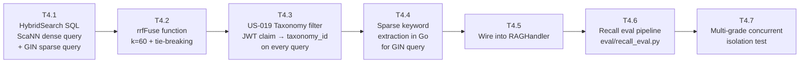

### Atomic Tasks

---

#### T4.1 — HybridSearch SQL Queries
**File:** `orchestrator/retrieval/hybrid_search.go`
**Time:** 2 hours

Two independent SQL queries, both filtered by `taxonomy_id`:

```sql
-- Dense: ScaNN cosine search with JOIN to parent for content
SELECT
    cc.child_id,
    cc.parent_id,
    ROW_NUMBER() OVER (ORDER BY cc.embedding <=> $1) AS rk,
    cc.embedding <=> $1 AS cosine_dist,
    cc.content,
    pc.content AS parent_content
FROM child_chunks cc
JOIN parent_chunks pc ON cc.parent_id = pc.parent_id
WHERE pc.taxonomy_id = $2
ORDER BY cc.embedding <=> $1
LIMIT 100;

-- Sparse: GIN keyword array intersection
SELECT
    pc.parent_id AS child_id,
    pc.parent_id,
    ROW_NUMBER() OVER (
        ORDER BY cardinality(
            array(SELECT unnest(pc.extracted_keywords)
                  INTERSECT
                  SELECT unnest($1::TEXT[]))
        ) DESC
    ) AS rk,
    0.0 AS cosine_dist,
    pc.content,
    pc.content AS parent_content
FROM parent_chunks pc
WHERE pc.taxonomy_id = $2
  AND pc.extracted_keywords && $1::TEXT[]
LIMIT 100;
```

**Critical:** Verify `EXPLAIN ANALYZE` shows `Index Scan using idx_child_embedding_scann` for dense query and `Bitmap Index Scan on idx_parent_keywords_gin` for sparse query.

---

#### T4.2 — `rrfFuse` Function
**File:** `orchestrator/retrieval/rrf.go`
**Time:** 1.5 hours

```go
// RRF(d) = Σᵢ 1 / (k + rankᵢ(d))
// k = 60 (production default)
//
// Tie-breaking order (deterministic):
//   1. PRIMARY:   RRF score DESC
//   2. SECONDARY: cosine_dist ASC (smaller distance = more similar)
//   3. TERTIARY:  child_id ASC (UUID lexicographic — full determinism)
//
// This prevents non-deterministic ordering on equal RRF scores,
// which would cause flapping results across requests.
//
// Unit test: same query × 10 calls → identical ranked slice every time
```

---

#### T4.3 — US-019 Taxonomy Filter
**File:** `orchestrator/handler/rag_handler.go`
**Time:** 30 min

```go
// JWT claim carries: {"grade": 7, "subject": "Science", "taxonomy_id": 42}
// extractTaxonomyFromJWT parses JWT and returns taxonomy_id (int)
// taxonomy_id is passed to EVERY HybridSearch call — never optional
//
// Unit test: Grade 6 JWT → taxonomyID=grade6_science_id
//            Grade 8 JWT → taxonomyID=grade8_science_id
//            Both in same test → assert different IDs extracted
```

---

#### T4.4 — Keyword Extraction in Go (for GIN query)
**File:** `orchestrator/retrieval/hybrid_search.go`
**Time:** 45 min

```go
// At serving time, YAKE is not available in Go.
// Use lightweight stopword-filtered bigram extraction:
//
// extractQueryKeywords(query string) []string
//   1. Lowercase, tokenise on whitespace + punctuation
//   2. Remove stopwords (small embedded set: the, a, an, is, are, was, were, in, of...)
//   3. Generate all bigrams + keep unigrams (len > 3)
//   4. Deduplicate, return max 8 terms
//
// This is intentionally simpler than YAKE.
// Sparse retrieval is a supplement to dense, not primary.
// False negatives in keyword extraction degrade recall marginally.
```

---

#### T4.5 — Wire HybridSearch into RAGHandler
**Time:** 30 min

Replace the stub `h.db.HybridSearch()` in Phase 3 with the real implementation. Pass `taxonomyID` extracted from JWT, `queryKeywords` from T4.4, `queryEmbedding` from T3.5.

---

#### T4.6 — Recall Eval Pipeline
**File:** `eval/recall_eval.py`
**Time:** 1.5 hours

```python
# Inputs:  JSONL eval sets (eval/sample_qna/*.jsonl)
#          Each line: {"question": str, "answer": str, "grade": int, "subject": str}
# Minimum: 200 Q&A pairs per subject (Grade 6 Bio, Grade 7 Chem, Grade 8 Physics)
#
# Metrics: Recall@1, Recall@3, Recall@5, Recall@10
# Hit definition: any of first 5 gold-answer words appear in retrieved chunk text
#
# Evaluation procedure:
#   1. For each QA pair, call HybridSearch with correct taxonomy_id
#   2. Check if gold answer tokens appear in top-k chunks
#   3. Report per-subject and aggregate metrics
#
# Target: Recall@5 > 0.85 per subject
# Report format: JSON + printed table
```

---

#### T4.7 — Multi-Grade Concurrent Isolation Test
**Time:** 1 hour

```python
# Using k6 or locust:
# Simultaneously:
#   - 50 VUs with Grade 6 Biology JWT
#   - 50 VUs with Grade 8 Physics JWT
#
# For each response, assert:
#   - All retrieved chunks have taxonomy_id matching the JWT grade
#   - No Grade 6 response contains Grade 8 content
#   - No Grade 8 response contains Grade 6 content
#
# This tests that the AlloyDB WHERE taxonomy_id = $2 filter
# is actually applied on every query, not just sometimes.
```

---

### Phase 4 Exit Criteria

```
✅ EXPLAIN ANALYZE on HybridSearch → idx_child_embedding_scann used (not seqscan)
✅ EXPLAIN ANALYZE on sparse query → idx_parent_keywords_gin used
✅ Recall@5 ≥ 0.85 on Grade 6 Biology eval set
✅ Recall@5 ≥ 0.85 on Grade 7 Chemistry eval set
✅ Recall@5 ≥ 0.85 on Grade 8 Physics eval set
✅ Same query × 10 calls → identical ranked result order (determinism test)
✅ 50 Grade 6 + 50 Grade 8 concurrent queries → zero cross-grade context leakage
```

---

## 7. Phase 5 — Quality Loop (Days 13–14)

### Task Graph

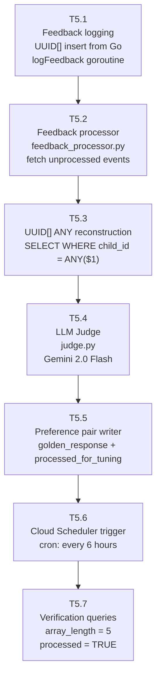

### Atomic Tasks

---

#### T5.1 — Feedback Logging (Go, UUID[])
**File:** `orchestrator/db/alloydb.go` (LogFeedback function)
**Time:** 45 min

```go
// Insert ai_feedback_loop row with UUID[] retrieved_context
// chunkIDs []string → pgtype.Array[pgtype.UUID]
//
// Critical: convert []string chunk IDs to proper UUID[] for PostgreSQL
// Use pgx v5 pgtype.Array:
//   uuids := make([]pgtype.UUID, len(chunkIDs))
//   for i, id := range chunkIDs {
//       uuid.Parse(id) → uuids[i]
//   }
//   INSERT INTO ai_feedback_loop(session_id, user_query, retrieved_context, llm_response)
//   VALUES($1, $2, $3, $4)
//
// feedback_score and user_action are NULL at insert time — updated by student UI later
// golden_response is NULL at insert time — populated by LLM Judge (T5.4)
```

**Unit test:** Insert row with 5 chunk IDs → `SELECT array_length(retrieved_context, 1)` = 5

---

#### T5.2 — Feedback Processor
**File:** `quality_loop/feedback_processor.py`
**Time:** 1 hour

```python
# Fetch unprocessed negative feedback:
# SELECT * FROM ai_feedback_loop
# WHERE feedback_score = -1
#   AND processed_for_tuning = FALSE
# ORDER BY created_at ASC
# LIMIT 100

# For each row:
#   1. Call T5.3 (UUID[] reconstruction)
#   2. Call T5.4 (LLM Judge)
#   3. Call T5.5 (write golden response)
#
# Safety: if judge call fails, do NOT mark processed_for_tuning = TRUE
# Retry semantics: failed rows remain unprocessed for next batch run
```

---

#### T5.3 — UUID[] ANY Reconstruction
**File:** `quality_loop/judge.py`
**Time:** 30 min

```python
# THE CRITICAL FIX — fetches ALL k chunks, not just 1
chunks = await conn.fetch(
    """
    SELECT cc.content, pc.content AS parent_content
    FROM child_chunks cc
    JOIN parent_chunks pc ON cc.parent_id = pc.parent_id
    WHERE cc.child_id = ANY($1)
    """,
    row["retrieved_context"]   # UUID[] — passes all 5 chunk IDs
)

# Validate: assert len(chunks) > 0
# If len(chunks) == 0: UUID references are stale (post-reingestion)
#   → log warning, skip this feedback row, do NOT generate golden response
#   → This is the content-addressable UUID problem noted in the architecture review
```

---

#### T5.4 — LLM Judge
**File:** `quality_loop/judge.py`
**Time:** 1.5 hours

```python
# Model: Gemini 2.0 Flash (judge quality > generation quality needed here)
# Run only on feedback_score = -1 events (NOT score=0 neutral events)
#
# Prompt structure:
# """
# You are a CBSE science education expert for Indian students.
# Using ONLY the following retrieved context, write a correct, complete,
# grade-appropriate answer. Do not add information outside the context.
#
# Retrieved Context:
# {context}                    ← ALL parent_content from UUID[] reconstruction
#
# Student Query: {user_query}
# Rejected Response (do NOT repeat this): {llm_response}
#
# Write a corrected, pedagogically sound response:
# """
#
# Validate output: len(golden_response) > 50 (reject empty/trivial outputs)
```

---

#### T5.5 — Preference Pair Writer
**File:** `quality_loop/judge.py`
**Time:** 30 min

```python
await conn.execute(
    """
    UPDATE ai_feedback_loop
    SET golden_response = $1,
        processed_for_tuning = TRUE
    WHERE feedback_id = $2
    """,
    golden_response, feedback_id
)
# Only mark processed_for_tuning = TRUE AFTER successful golden_response write
# Atomic: both or neither (within transaction)
```

---

#### T5.6 — Cloud Scheduler Trigger
**Time:** 30 min

```bash
gcloud scheduler jobs create http visionary-quality-loop \
  --schedule="0 */6 * * *" \
  --uri="https://CLOUD_RUN_JOB_URL/run" \
  --http-method=POST \
  --location=asia-south1
```

Runs every 6 hours. Processes up to 100 negative feedback events per run.

---

#### T5.7 — Verification Queries
**Time:** 30 min

```sql
-- Verify UUID[] stores all 5 chunk IDs
SELECT array_length(retrieved_context, 1) AS chunk_count
FROM ai_feedback_loop
ORDER BY created_at DESC
LIMIT 5;
-- Expected: all rows return 5

-- Verify judge processed events
SELECT
    COUNT(*) FILTER (WHERE processed_for_tuning = TRUE AND golden_response IS NOT NULL) AS processed,
    COUNT(*) FILTER (WHERE processed_for_tuning = FALSE) AS pending,
    COUNT(*) FILTER (WHERE feedback_score = -1) AS negative
FROM ai_feedback_loop;
```

---

### Phase 5 Exit Criteria

```
✅ Trigger feedback event → array_length(retrieved_context, 1) = 5 (not 1)
✅ LLM Judge batch → golden_response IS NOT NULL for processed rows
✅ processed_for_tuning = TRUE only after golden_response is written
✅ Stale UUID edge case: rows with missing chunks → skipped with warning log, not crashed
✅ Load test: p50 < 300ms, p95 < 480ms, p99 < 500ms, error rate < 0.1% at 1,000 VUs × 5min
```

---

## 8. Testing Strategy

### 8.1 Test Pyramid

```mermaid
pyramid
```

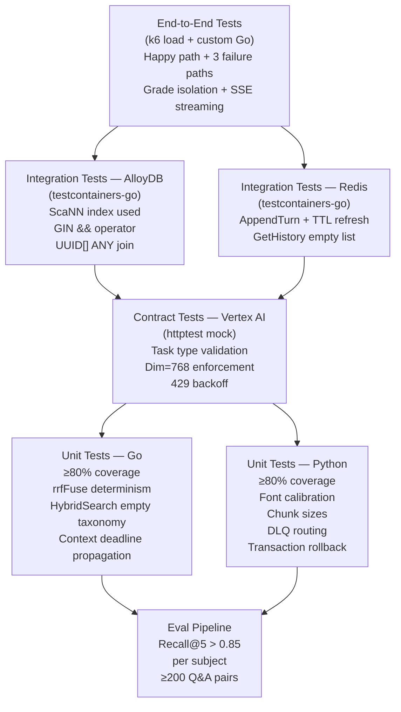

### 8.2 Critical Test Cases

| Layer | Test Case | Pass Condition |
|---|---|---|
| Unit (Go) | `rrfFuse` tie-breaking | Same input × 10 → identical output slice |
| Unit (Go) | Context deadline at 450ms | `writeSSEError` called within 460ms |
| Unit (Go) | Grade isolation in JWT extraction | Grade 6 JWT ≠ Grade 8 taxonomy_id |
| Unit (Python) | Child chunk max 512 chars | `assert all(len(c.content) <= 512)` |
| Unit (Python) | TEXT[] insertion | `array_length(extracted_keywords,1)` = 6–8 |
| Unit (Python) | DLQ on embedding failure | `ingestion_dlq` row created, parent NOT in DB |
| Integration | ScaNN index usage | `EXPLAIN ANALYZE` → `idx_child_embedding_scann` |
| Integration | GIN `&&` operator | keyword intersection returns correct parents |
| Integration | UUID[] ANY join | 5 rows returned from 5-element UUID[] |
| Contract | Embed task type | Request body contains `"task_type": "RETRIEVAL_QUERY"` |
| E2E | Cross-grade isolation | Grade 6 query → 0 Grade 8 chunks in top-5 |
| E2E | SSE TTFT | First `data:` frame arrives within 500ms |
| E2E | Disconnect handling | Pool connections return to baseline within 5s |
| Eval | Recall@5 per subject | ≥0.85 for Grade 6 Bio, Grade 7 Chem, Grade 8 Physics |

---

## 9. Observability Wiring

### 9.1 Metrics + Alerts

```mermaid
flowchart LR
    Go["Go OTel SDK"]
    Py["Python structlog\n(Cloud Logging)"]
    CM["Cloud Monitoring\nMetrics"]
    CT["Cloud Trace\nDistributed Spans"]
    PD["PagerDuty\nAlerting"]

    Go -->|gRPC OTLP| CM
    Go -->|gRPC OTLP| CT
    Py --> CM

    CM -->|p99 TTFT > 510ms\n1min window| PD
    CM -->|Recall@5 < 0.70\n1hr window| PD
    CM -->|Error rate > 1%\n2min window| PD
    CM -->|DLQ depth > 50\n15min window| PD
    CM -->|PgBouncer active_clients > 9000\n5min window| PD
```

### 9.2 OTel Span Structure Per Request

```mermaid
gantt
    title OTel Span Hierarchy Per Request
    dateFormat  X
    axisFormat  %sms

    section rag.query (root)
    session.get          :done, 0, 1
    vertex.rewrite       :done, 1, 31
    vertex.embed         :done, 31, 81
    alloydb.hybrid_search:done, 81, 96
    rrf.fuse             :done, 96, 97
    vertex.generate      :crit, 97, 450
```

### 9.3 Key SLA Alerting Thresholds

| Metric | Warning | Critical | Window | Action |
|---|---|---|---|---|
| p99 TTFT | >490ms | >510ms | 1 min | PagerDuty |
| p95 TTFT | >450ms | >500ms | 2 min | Investigate |
| Recall@5 | <0.80 | <0.70 | 1 hr | ScaNN REINDEX |
| Error rate (5xx) | >0.5% | >1% | 2 min | PagerDuty |
| DLQ depth | >10 | >50 | 15 min | Ingestion investigation |
| PgBouncer clients | >8,000 | >9,000 | 5 min | Scale Cloud Run |
| Redis p50 | >3ms | >5ms | 2 min | Check memory pressure |

---

## 10. Deployment & CI/CD

### 10.1 Pipeline

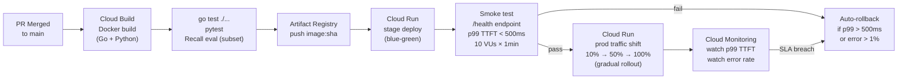

### 10.2 Schema Migration Safety

```
Rule: NEVER run DDL migrations inside a transaction that catches errors silently.
Rule: Always use explicit migration files (schema/v2_production.sql, schema/v3_*.sql).
Rule: Test migrations on a staging AlloyDB clone before production.
Rule: CREATE INDEX ... CONCURRENTLY for adding indexes post-launch (no table lock).
Rule: Never DROP a column — use soft delete (add deprecated_at column).
```

---

## 11. Sprint Verification Checklist

### Master Verification Matrix

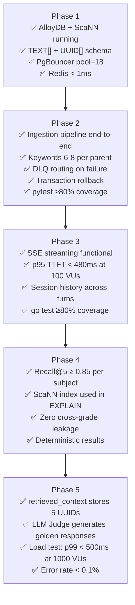

### Load Test Final Acceptance (Phase 5, Day 14)

```
Scenario: 1,000 concurrent students, 5-minute burst
Tool: k6

Acceptance criteria:
  ✅ p50 TTFT < 300ms
  ✅ p95 TTFT < 480ms
  ✅ p99 TTFT < 500ms          ← US-018 SLA
  ✅ Error rate (5xx) < 0.1%
  ✅ AlloyDB pool exhaustion: 0 occurrences
  ✅ PgBouncer active_server_connections returns to baseline within 5s of load end

Failure conditions (auto-rollback triggers):
  ❌ Any p99 > 500ms for 3+ consecutive minutes
  ❌ Error rate > 2%
  ❌ Cross-grade context leakage in any response
  ❌ PgBouncer connection queue exhaustion
```

---

### Known Risks Not Addressed in Architecture v2.0

| Risk | Impact | Recommended Fix |
|---|---|---|
| Stale UUID after chunk re-ingestion | Quality loop generates corrupted preference pairs silently | Use content-hash chunk IDs instead of `gen_random_uuid()` |
| Session history context overflow | Prompt exceeds 4,000 tokens → generation degrades | Add token-counting truncation in `GetHistory` |
| Concurrent k tuning + Vertex AI tuning jobs | Tuning ingests biased preference pairs | Gate first tuning job on 200 events, block k grid-search during active tuning job |
| Gemini generation latency spike | 350ms budget breached → p99 breaks SLA | Add circuit breaker with Gemini 2.0 Flash fallback on generation latency > 300ms |
| 90-day retention race with active tuning job | Purge deletes preference pairs mid-training | Soft-delete with `purge_after_training = FALSE` flag cleared by tuning job completion hook |

---

*This plan covers 44 atomic tasks across 5 phases and 14 days. Each task has a single, independently verifiable exit criterion. Start with Phase 1 Day 0 — apply the corrected schema DDL before any other work.*
